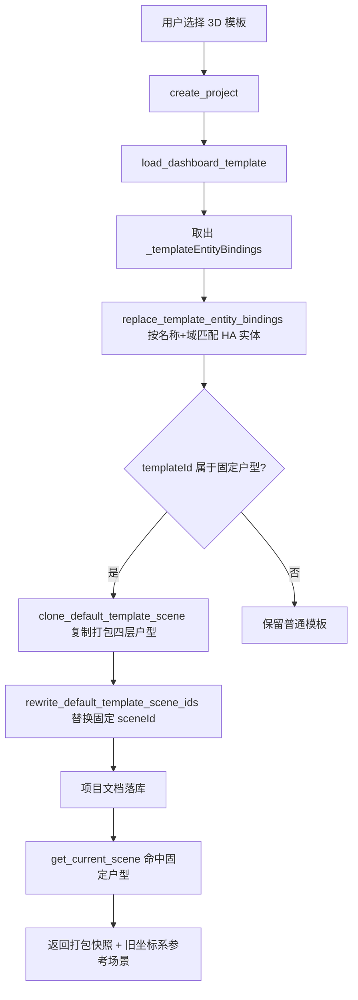

# HA Bridge 发布说明 V0.6.1

- 版本：`0.6.1`
- 对比基线：`0.5.6`
- 对比对象：`源代码/app V0.5.6` 与 `源代码/app V0.6.1`
- 文档日期：2026-09-19
- 产品版本标识：`releaseId` 由 `d81389d74ef6532c1223c7f07a3763d3` 变为 `04e95d3009c37b38f1fd038dc223a996`

> 说明：两份产物均为**混淆后的发布包**（后端 PyArmor，前端 javascript-obfuscator 单行压缩）。本文结论以**后端反汇编（完整）+ 反编译（交叉验证）**、**迁移实现**、**模板 JSON 直接解析**为主，前端部分结合**缓存戳、ES 模块导入图、字节增量、字符串差分**。文末附「分析方法与置信度」。

---

## 摘要

V0.6.1 是一次以 **「3D 固定户型模板项目」** 为主线、叠加 **「光照/页面外观策略固化」**，并包含若干性能与体验修复的版本。核心变化：

1. 新增两套 **内置 3D 户型**的仪表盘模板（iPad 暖阳原木 / 手机默认），并提供打包户型快照与「按实体名称+域」迁移到用户 HA 的能力；模板项目的 3D 场景不再受用户全局 3D 草稿影响。
2. 把 3D 灯光效果范围、区域光照、页面明暗与对焦暗角固化为产品预设，并通过 5 个数据库迁移对历史项目做一次性对齐。
3. 3D 草稿保存上限翻倍、交互授权窗口放宽等稳定性/体验优化。
4. 三维工作台在区域光照、暖色植被、反射、阴影、导出、投影取景等方面的一批表现优化。
5. 依赖组件零增删；**没有任何文件被删除**。

---

## 一、变更总览

| 维度 | 变化 |
| --- | --- |
| 后端 Python | 6 个文件有实质逻辑变更；新增 2 个模块 |
| 数据库迁移 | 新增 `0015`–`0019`（原有 `0001`–`0014` 逻辑零改动） |
| 前端 | 193 个文本产物中 141 个变化、137 个有真实内容增量；新增 3 个 ES 模块 |
| 模板/素材 | 新增 2 套 3D 模板 + 1 个默认户型快照 + 4 张底图 + 2 张模板预览图 + 1 张背景图 |
| 依赖 | `sbom.cdx.json` 组件无增删 |
| 删除 | 无（唯一“消失”的仅为 `.DS_Store`） |
| 版本号 | `VERSION` 与各页面展示由 `0.5.6` → `0.6.1` |

后端实质变更文件：
`backend/app/modules/interaction3d/api.py`、`backend/app/modules/interaction3d/access.py`、`backend/app/modules/interaction3d/config.py`、`backend/app/api/projects.py`、`backend/app/ui_packs.py`、`backend/app/api/studio3d.py`。

后端新增模块：
`backend/app/modules/interaction3d/template_scenes.py`、`backend/app/panel/template_entities.py`。

---

## 二、新增功能

### 2.1 3D 固定户型模板项目（核心）

新增两套**内置 3D 户型**的仪表盘模板，并提供配套后端链路，保证模板自带的户型不被用户的自定义 3D 草稿覆盖。

**新增模板**（`dashboard_templates/`）

- `qiguang-3d-ipad-warm-wood-v1.json.gz`：**栖光3D-iPad（暖阳原木）**
  - 画布 1852×1293（横版），`componentScale=2.1703125`
  - 单页「3D交互」，单个 `interaction3d` 控件
  - `sceneStyle=warm-wood`，`lightingMode=region`
  - 内置 `_templateEntityBindings` 402 条
- `qiguang-3d-phone-default-v1.json.gz`：**栖光3D-手机（默认主题）**
  - 画布 800×1731（竖版）
  - 单页「3D交互」，单个 `interaction3d` 控件
  - `sceneStyle=default`，`lightingMode=region`
  - 内置 `_templateEntityBindings` 399 条
- 两者元数据：`sourceTemplate.id = qiguang-3d-floorplan-readonly`，`dashboardTemplate.templateId` 分别为 `qiguang-3d-ipad-warm-wood` / `qiguang-3d-phone-default`

**新增打包户型快照**

- `qiguang-3d-default-scene-v1.json.gz`：**四层户型**（B1 / 一层 / 二层 / 三层，共 247 个物件，revision 8119，402 条实体绑定）
- `qiguang-3d-default-background.png`：默认户型底图

**新增后端模块**

- `backend/app/modules/interaction3d/template_scenes.py`
  - `load_default_template_scene(settings, *, database)`：从打包快照加载户型，**强制不读全局 studio 草稿**
  - `load_default_template_reference_scene(...)`：输出「旧单层相机坐标系」参考场景，用于把历史相机位姿换算到新的四层坐标系
  - `clone_default_template_scene(...)`：把打包户型复制为**项目独立快照**（`data_dir/modules/interaction3d/scenes/{uuid}.json`，`chmod 0o600`，并复制底图资源）
  - `rewrite_default_template_scene_ids(...)`：遍历文档，将固定 `sceneId = 308eb3fb77ed426cbfd65545bbfcb11a` 惰性替换为克隆出的场景 ID
- `backend/app/panel/template_entities.py`
  - 常量 `TEMPLATE_ENTITY_BINDINGS_KEY = '_templateEntityBindings'`
  - `replace_template_entity_bindings(value, bindings, database)`：按「实体名称 + domain（必要时含 device）」在当前 HA 目录中做**精确匹配替换**，实现模板在不同用户环境下的实体迁移

**新增/变更的后端行为**

- `backend/app/modules/interaction3d/api.py`
  - 新增 `FIXED_FLOORPLAN_TEMPLATE_IDS = frozenset({'qiguang-3d-ipad-warm-wood', 'qiguang-3d-phone-default'})`
  - 新增 `_is_fixed_floorplan_template(database, project_id)`：当项目文档 `dashboardTemplate.templateId` 命中固定集合，或任一组件 `properties.templateReadonly is True` 时判定为固定户型
  - `get_current_scene(...)` 新增 `database` 形参；命中固定户型时改为返回打包快照（并按需返回 reference 场景），从而**忽略用户可编辑的全局 3D 草稿**
- `backend/app/api/projects.py` 创建项目时
  - 取出并移除 `_templateEntityBindings` 后执行 `replace_template_entity_bindings(...)`
  - 若 `template.id ∈ {qiguang-3d-phone-default, qiguang-3d-ipad-warm-wood}`，执行 `rewrite_default_template_scene_ids(...)`
- `backend/app/modules/interaction3d/config.py`
  - `interaction3d` 组件新增可选布尔属性 **`templateReadonly`**（标记只读固定户型）
- `backend/app/ui_packs.py`
  - 在 `ui.base` 下注册上述两个 `DashboardTemplate`（含预览图 URL 与标签）

**既有模板的配套改动**

- `dashboard_templates/dwell-light-v1.json.gz`：页面结构完全不变，**唯一变化是新增 `_templateEntityBindings`（104 条）**，使旧模板同样具备实体自动迁移能力。

**数据流**

### 2.2 光照与页面外观策略固化

把此前可自由配置的 3D 光影与页面明暗固化为产品级预设，并对历史数据做一次性对齐。

**新增前端策略模块**（`frontend/static/modules/interaction3d/`）

- `light-effect-policy.js`
  - `LIGHT_EFFECT_RANGE = { brightnessMin: 50, brightnessMax: 150, temperatureMin: 2700, temperatureMax: 6500 }`
  - `LIGHT_EFFECT_DEFAULTS = { brightness: 150, kelvin: 3500 }`
  - `withFixedLightEffects(properties)`：写入固定 `effectRange` / `effectDefaults`
- `region-lighting-presets.js`
  - 公共底：`ambientIntensity 0.16`、`hemisphereIntensity 0.58`、`mainAzimuth 139`、`mainElevation 55`、`mainIntensity 2.05`、`mainShadowIntensity 0.18`、`fillAzimuth -48`、`fillElevation 28`、`fillIntensity 0.16`、`topAzimuth 90`、`topElevation 86`、`topIntensity 0.12`
  - `default`：`exposure 0.95`、`floorBrightness 75`
  - `warm-wood`：`exposure 0.6`、`floorBrightness 50`
  - `withRegionLightingPreset()`：仅当 `lightingMode === 'region'` 时生效
- `page-appearance-presets.js`
  - `pageDimStrength`：`overview/light = 0`，`environment/devices/vacuum/security = 30`
  - `pageSaturation`：全部 100
  - `focusDimStrength`：0
  - `focusVignetteStrength`：0
  - `withPageAppearancePreset()`：按 `sceneStyle` 选择 `default` / `warm-wood`（两者当前取值一致）

**接入点（确证）**

- `frontend/modules/interaction3d/stage.js` 新增导入：`light-effect-policy.js`、`page-appearance-presets.js`、`region-lighting-presets.js`
- `frontend/modules/interaction3d/config-editor.js` 新增导入 `/bridge-static/modules/interaction3d/light-effect-policy.js?v=20260918-fixed-effects-v2-review-1234`，并**移除旧的 `light-state.js` 导入**
- `frontend/static/modules/interaction3d/definition.js` 引用 `withPageAppearancePreset`

---

## 三、优化

### 3.1 后端限额与授权窗口

- `backend/app/api/studio3d.py`：`MAX_DRAFT_BYTES` **32 MiB → 64 MiB**（`33554432` → `67108864`），提升大型 3D 草稿保存上限
- `backend/app/modules/interaction3d/access.py`：`MAX_GRANT_SECONDS` **15 → 60**，与显示端缓存戳 `access-poll-30s-v1` 配合，降低授权过期导致的重复取权/卡顿

### 3.2 3D 工作台表现

`studio-app.js` 新增缓存戳实体：`projection-framing-v1`、`theme-light-v11`、`default80`、`wall-union-v3`、`warm-bg-v13`、`hide-wall-contact-v1`、`20260918-review-1234-v2`。

内容增量最大的模块与推断方向：

- `frontend/static/3d-studio/studio-plan2-region-lights.js`（+1079）：区域光照
- `frontend/static/3d-studio/geometry.js`（+493）：几何
- `frontend/static/3d-studio/studio-warm-foliage.js`（+432）：暖阳原木植被
- `frontend/static/3d-studio/studio-reflection-detail.js`（+385）：反射细节
- `frontend/static/3d-studio/studio-external-models.js`（+321）：外部模型
- `frontend/static/3d-studio/studio-ground-reflections.js`（+256）、`export-utils.js`（+256）、`export-presets.js`（+199）：地面反射与导出
- `frontend/static/3d-studio/studio-shadow-atlas.js`（+216）：阴影图集
- `frontend/modules/interaction3d/scene-background.js` 版本戳 `20260916-warm-v1` → `20260918-warm-v9-flat-stars-20260918-review-1234-v2`（暖色背景 v9、扁平星点）

### 3.3 编辑器 / 渲染 / 设备

- `frontend/static/editor-document-management.js`（+475）：新增 `sessionStorage` 记忆选中项目（键 `ha-bridge:editor:selected-project`），并扩展 `media_player` / `number` / `water_heater` 域处理
- `frontend/static/renderer/registry.js`（+685）
- `frontend/static/modules/interaction3d/editor-pickers.js`（+374）
- `frontend/modules/interaction3d/security-editor.js`（+368）
- `frontend/static/modules/interaction3d/nas-catalog.js`（+298）
- `frontend/modules/interaction3d/television-screen.js`（+265）
- `frontend/modules/interaction3d/nas-panel.js`（+255）
- `frontend/modules/interaction3d/range-dialog.js`（+222，涉及 `dialog` / 外链样式表）
- `frontend/modules/interaction3d/curtain-motion.js`（+211）
- `frontend/modules/interaction3d/light-state.js`（+184）
- `frontend/static/app.css`（+178）：新增缓存戳实体 `template-preview-contain-v4`、`20260919-project-dialog-compact-v1`
- `frontend/index.html` 的 `home.js` 缓存戳整体切换为 `20260918-template-preview-v3`

---

## 四、修复

- 授权窗口过短：`MAX_GRANT_SECONDS` 15 → 60，配合 `access-poll-30s-v1`，修复访问授权在轮询周期内过期引发的重复取权/闪烁。
- 模板项目 3D 场景被全局草稿污染：固定户型模板改由打包快照供给场景，避免用户自定义草稿覆盖模板户型（`load_default_template_scene` / `_is_fixed_floorplan_template`）。
- 历史项目光照/外观不一致：通过迁移 `0015`–`0018` 对齐到已确认预设。
- 对焦暗角：由迁移 `0018` 与前端 `page-appearance-presets`（`focusVignetteStrength = 0`）统一关闭。

> 注：`0019_interaction3d_disable_warm_reflections` 为**空迁移**，其语义是「保留用户自定义地面反射，不做覆盖」，即一处**刻意不修改**的收敛决定。

---

## 五、数据库迁移（`0015`–`0019`）

迁移链：`0014 → 0015 → 0016 → 0017 → 0018 → 0019`。五者 `downgrade()` 均为空（不提供数据回滚），升级时会自增 `revision` 并规范化 JSON。

- `0015_interaction3d_light_effect_policy`
  - 把既有 3D 控件的 `effectRange` 写为 `{brightnessMin:50, brightnessMax:150, temperatureMin:2700, temperatureMax:6500}`、`effectDefaults` 写为 `{brightness:150, kelvin:3500}`
  - **不触碰** HA 实体、工作室手工灯与 `baseLighting`
- `0016_interaction3d_region_theme_presets`
  - 对 `type=interaction3d` 且 `properties.lightingMode='region'` 的控件，按 `sceneStyle`（`warm-wood` / `default`）固化 `baseLighting`
- `0017_interaction3d_page_appearance_presets`
  - 按 `sceneStyle` 固化 `pageDimStrength` / `pageSaturation` / `focusDimStrength` / `focusVignetteStrength`
- `0018_interaction3d_zero_focus_vignette`
  - 将所有既有 3D 控件的 `focusVignetteStrength` 归零
- `0019_interaction3d_disable_warm_reflections`
  - 空迁移（no-op），语义为保留用户地面反射配置

---

## 六、模板与素材清单

新增：

- `dashboard_templates/qiguang-3d-default-scene-v1.json.gz`（默认四层户型快照）
- `dashboard_templates/qiguang-3d-default-background.png`
- `dashboard_templates/qiguang-3d-ipad-warm-wood-v1.json.gz`
- `dashboard_templates/qiguang-3d-phone-default-v1.json.gz`
- `frontend/static/ui-packs/qiguang-3d-ipad-warm-wood.png`（模板预览）
- `frontend/static/ui-packs/qiguang-3d-phone-default.png`（模板预览）
- `frontend/static/modules/interaction3d/light-effect-policy.js`
- `frontend/static/modules/interaction3d/page-appearance-presets.js`
- `frontend/static/modules/interaction3d/region-lighting-presets.js`
- `image/v1/底图/栖光-暖阳原木-横版.png`
- `image/v1/底图/栖光-暖阳原木-竖版.png`
- `image/v1/底图/栖光-默认风格-横版.png`
- `image/v1/底图/栖光-默认风格-竖版.png`

变更：

- `dashboard_templates/dwell-light-v1.json.gz`：新增 `_templateEntityBindings`（104 条），页面结构不变
- `migrations/versions/0015`–`0019` 及 `alembic_runtime/versions` 对应 shim

---

## 七、兼容性与升级注意

1. 迁移 `0015`–`0018` 会**改写既有项目的 3D 光影/外观字段**，`downgrade()` 为空，升级前请备份数据库。
2. 固定户型模板项目依赖打包快照 `qiguang-3d-default-scene-v1.json.gz` 与底图 `qiguang-3d-default-background.png`，升级包必须完整包含这两个文件，否则打开模板项目会报「3D 模板默认户型快照缺失」/「底图缺失」。
3. 新模板创建时会**克隆一份项目独立场景**到 `data_dir/modules/interaction3d/scenes/`，会产生额外磁盘占用（每套模板一份快照 + 底图副本）。
4. `MAX_DRAFT_BYTES` 提升至 64 MiB，仅放宽上限，不影响旧数据。
5. `MAX_GRANT_SECONDS` 提升至 60s，若非对称升级（仅升级一端），建议前后端一并升级以匹配轮询周期。
6. `sbom.cdx.json` 组件无变化，无新增第三方依赖。

---

## 八、附录：主要变更文件

### 后端

- 变更：`backend/app/modules/interaction3d/api.py`、`access.py`、`config.py`、`backend/app/api/projects.py`、`backend/app/api/studio3d.py`、`backend/app/ui_packs.py`
- 新增：`backend/app/modules/interaction3d/template_scenes.py`、`backend/app/panel/template_entities.py`
- 运行库：`backend/pyarmor_runtime_004721/`（运行时重新加壳）

### 前端（按内容增量排序，前 20）

| 增量(字节) | 文件 |
| --- | --- |
| +2281 | `frontend/modules/interaction3d/stage.js` |
| +1141 | `frontend/static/3d-studio/studio-app.js` |
| +1079 | `frontend/static/3d-studio/studio-plan2-region-lights.js` |
| +685 | `frontend/static/renderer/registry.js` |
| +493 | `frontend/static/3d-studio/geometry.js` |
| +475 | `frontend/static/editor-document-management.js` |
| +432 | `frontend/static/3d-studio/studio-warm-foliage.js` |
| +385 | `frontend/static/3d-studio/studio-reflection-detail.js` |
| +374 | `frontend/static/modules/interaction3d/editor-pickers.js` |
| +368 | `frontend/modules/interaction3d/security-editor.js` |
| +321 | `frontend/static/3d-studio/studio-external-models.js` |
| +298 | `frontend/static/modules/interaction3d/nas-catalog.js` |
| +265 | `frontend/modules/interaction3d/television-screen.js` |
| +264 | `frontend/static/3d-studio/studio-runtime-furniture.js` |
| +256 | `frontend/static/3d-studio/studio-ground-reflections.js` |
| +256 | `frontend/static/3d-studio/export-utils.js` |
| +255 | `frontend/modules/interaction3d/nas-panel.js` |
| +222 | `frontend/modules/interaction3d/range-dialog.js` |
| +216 | `frontend/static/3d-studio/studio-shadow-atlas.js` |
| +211 | `frontend/modules/interaction3d/curtain-motion.js` |

---

## 九、分析方法与置信度

- **后端（高置信）**：对 `.das` 完整反汇编剔除 PyArmor 噪声（`__pyarmor_enter/exit/assert_<id>`、`<COAddr>`）后，仅 6 个文件存在真实差异；`.cdc.py` 反编译存在 `Decompyle incomplete`，仅用于交叉验证。迁移与模板 JSON 为直接解析。
- **前端（中高置信）**：产物混淆/单行压缩，采用四路交叉：
  1. HTML 缓存戳映射到具体资源（确证新增功能标签）
  2. ES 模块导入图差分（确证新模块接入点）
  3. 文件字节增量排序（定位实质变更文件）
  4. 逐文件字符串差分（辅助推断行为）
- **无变化确认**：`sbom.cdx.json` 组件集合一致；`0001`–`0014` 迁移逻辑一致；除 `.DS_Store` 外无文件删除。
